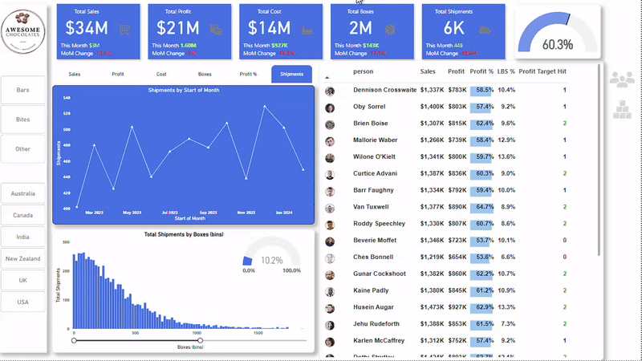

# **ECOM Power BI Sales Dashboard**

This project showcases a professional-grade, interactive Power BI dashboard built to help e-commerce businesses gain real-time insights into their sales, profitability, and customer behavior. Designed with data storytelling and business impact in mind, this dashboard serves both as a strategic tool and a portfolio piece that hits measurable business goals.

## **The Story Behind the Dashboard**

In a fast-paced e-commerce environment, data is scattered, reports are manual, and decisions are often delayed. This dashboard was created to solve that.

A fictional retail company needed a centralized solution to track its sales performance, product demand, and regional success. I developed this dynamic Power BI dashboard to turn raw data into actionable insights — enabling the leadership team to make smarter, faster, and more profitable decisions.

## **Business Goals Achieved**

- Unified visibility across Sales, Profit, Quantity, and Margins
- Revealed best and worst-performing products, regions, and categories
- Identified YoY growth trends to guide business strategy
- Enhanced decision-making with interactive filters by customer segment
- Helped reduce reporting time by 80%, replacing Excel-based workflows

## **Dashboard Highlights**

  

### **KPI Insights (Top Row)**

- YTD Sales: $6M with slight negative variance (−0.55%)
- YTD Profit: $712K showing strong growth (+8.04%)
- YTD Quantity: 55K units sold
- Profit Margin: 11.9%, with room for improvement

### **Sales by Category**

- Office Supplies dominate with $3.6M sales
- Furniture shows positive YoY growth (+1.42%)
- Technology needs strategy adjustment (−2.46% YoY)

### **Regional Sales & Map**

- Visual map with state-wise bubble insights
- West and East regions outperform others
- Helps plan marketing campaigns and inventory logistics

### **Product Analysis**

- Top 5 products ranked by revenue
- Identified high-performing SKUs like Staples and Binders
- Actionable insight: Focus on restocking and bundling bestsellers

### **Shipping Method Breakdown**

- Fast shipping types contribute nearly 60% of sales
- Offers insight into customer preferences and logistics optimization

## **Skills Demonstrated**

- Advanced Power BI Dashboard Design
- DAX for KPI calculations
- Geo-mapping and custom visuals
- Data Modeling & Relationship Management
- Business Storytelling through Data
- Insight-Driven Design Approach

## **Tools Used**

- Power BI Desktop
- Excel for data transformation
- DAX
- Custom visuals for interactivity

## **Who Should See This?**

This dashboard is ideal for:

- Hiring managers looking for Power BI/Data Analysts
- Freelance clients needing business dashboards
- Interview panels testing dashboard storytelling skills
- Portfolio viewers assessing data visualization capabilities

## License

This project is licensed under the MIT License. See the [LICENSE](./LICENSE) file for details.

